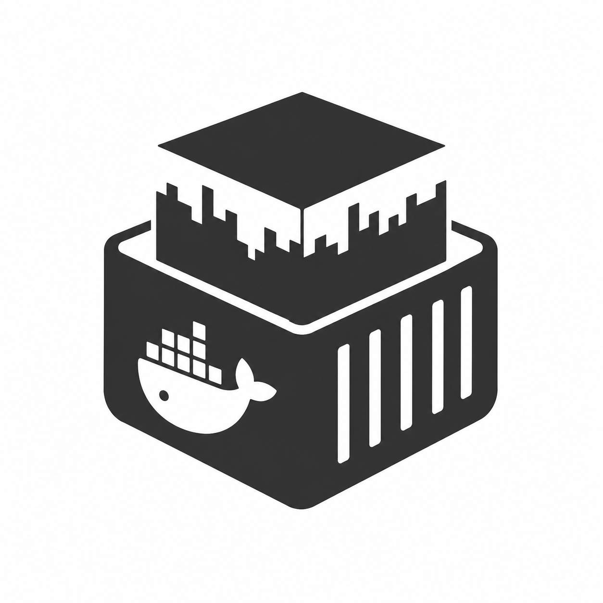

<div align="center">

<!-- Neither logo has an alpha channel: logo.png is on black, logo_flat.png on
     white, so each is served to the theme whose background it already matches. -->
<picture>
  <source media="(prefers-color-scheme: dark)" srcset="logo.png">
  
</picture>

# Minecraft modpack server images

</div>

Ready-to-run Docker images for Minecraft modpack servers. The whole modpack is
baked into the image, so there is nothing to download or install on first start
— bring a `docker-compose.yml` and a volume and you have a server.

**[Browse the packs →](https://leberkas-org.github.io/minecraft-ftb-docker/)**

If these images save you an evening of setup, you can
[buy me a coffee](https://ko-fi.com/dirnei).

## Quick start

Copy this to your server as `docker-compose.yml`:

```yaml
services:
  minecraft:
    image: ghcr.io/leberkas-org/minecraft_atm_10:latest
    container_name: minecraft
    environment:
      # By setting this you accept the Minecraft EULA: https://aka.ms/MinecraftEULA
      EULA: "true"
      MEMORY: 10G
    ports:
      - "25565:25565"
    volumes:
      - ./data:/data
    stop_grace_period: 120s
    restart: unless-stopped
```

```bash
docker compose up -d
docker compose logs -f
```

Wait for `Done (…)! For help, type "help"` and connect. First start takes a few
minutes while the world is generated; later starts are quick.

Pick the image for the pack you want from [Available images](#available-images),
and give it enough memory — modded servers are hungry, and the recommended heap
is listed with each pack.

## Configuration

Everything is set through environment variables. Only `EULA` is required.

| Variable | Default | Purpose |
| --- | --- | --- |
| `EULA` | *(unset)* | Must be `true`. The server refuses to start otherwise. |
| `MEMORY` | *(pack default)* | Heap size, e.g. `8G`. Change it any time — no rebuild. |
| `MOTD` | — | Message shown in the server list. |
| `DIFFICULTY` | — | `peaceful` / `easy` / `normal` / `hard`. |
| `MAX_PLAYERS` | — | Player cap. |
| `LEVEL_SEED` | — | World seed. First run only. |
| `ENABLE_RCON` | `false` | Enables remote console; requires `RCON_PASSWORD`. |
| `RCON_PASSWORD` | — | Required when RCON is on. |
| `SERVER_PORT` | `25565` | Listen port. |
| `RCON_PORT` | `25575` | RCON port. Bind it to `127.0.0.1` if you expose it. |
| `EXTRA_JVM_ARGS` | — | Extra JVM flags, space separated. |
| `PUID` / `PGID` | `1000` | Owner of `/data`, to match your host user. |

Anything not covered here can be set in `data/server.properties` after the first
start — it is yours to edit and is never overwritten.

## Your data

Everything worth keeping lives in the single `/data` volume:

```
data/world              data/server.properties     data/ops.json
data/logs               data/whitelist.json        data/banned-players.json
data/backups            data/crash-reports         data/usercache.json
```

Back up that directory and you have backed up the server. It also means pulling
a newer image keeps your world — the pack lives in the image, your data does not.

```bash
docker compose pull && docker compose up -d
```

Stop the server with `docker compose stop`, not by killing it. The image asks
the server to save and shut down cleanly, which is why `stop_grace_period` is
set to 120s — a modded server killed mid-save corrupts its region files.

## Available images

### All the Mods 10


Minecraft 1.21.1 · NeoForge · 10G recommended

```
ghcr.io/leberkas-org/minecraft_atm_10:latest
```

- [Modpack](https://www.curseforge.com/minecraft/modpacks/all-the-mods-10)

<br clear="right">

### FTB Skies


Minecraft 1.19.2 · Forge · 8G recommended

```
ghcr.io/leberkas-org/minecraft_ftb_skies:latest
```

- [Modpack](https://feed-the-beast.com/modpacks/103-ftb-skies)

<br clear="right">

Each image is also tagged with its pack version (`:7.3`) and the upstream
version id (`:pack-version-8558519`), if you would rather pin than float.

## Adding a pack

Any modpack on the [modpacks.ch](https://modpacks.ch) index can be built —
CurseForge packs and FTB's own. Adding one means adding a single file to
`packs/`, generated from the pack's id:

```powershell
.\src\propose-pack.ps1 -Id 1298402
```

That writes `packs/<name>.env` with the newest release, tag, Minecraft and
modloader versions and an estimated heap. `PACK_ID` is the **Project ID** in the
CurseForge sidebar, or the number in an FTB pack URL.

Build and try it locally:

```powershell
.\src\build.ps1 -Pack atm10sky
```

Then open a pull request. Adding the `build` label runs the checks, which build
the image and boot the server to prove the pack actually starts; merging
publishes it. A scheduled job opens a pull request whenever a pack has a newer
release, so images stay current on their own.
